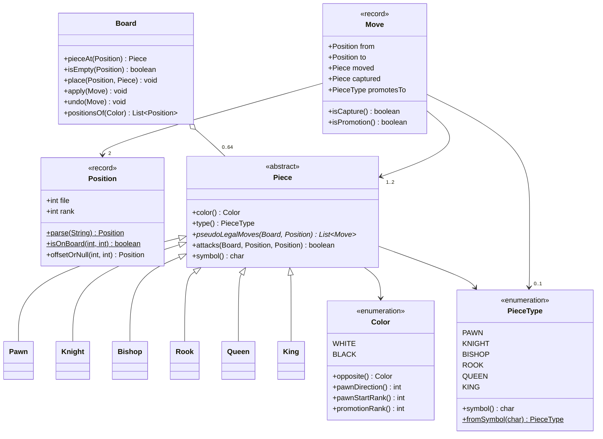
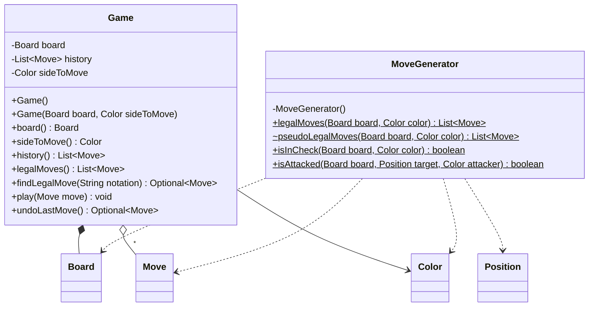
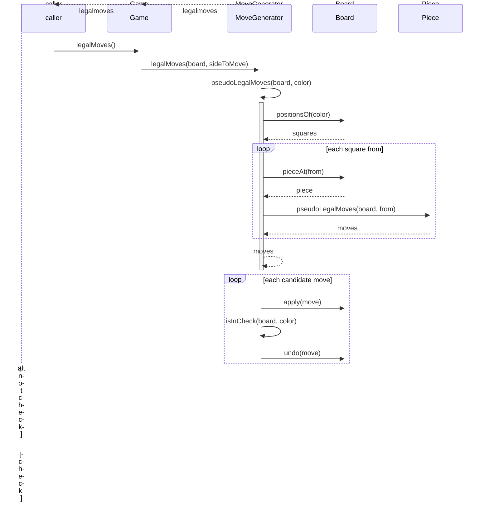

```mermaid
classDiagram
class Position {
<<record>>
+int file
+int rank
+parse(String)$ Position
+isOnBoard(int, int)$ boolean
+offsetOrNull(int, int) Position
}
class Color {
<<enumeration>>
WHITE
BLACK
+opposite() Color
+pawnDirection() int
+pawnStartRank() int
+promotionRank() int
}
class PieceType {
<<enumeration>>
PAWN
KNIGHT
BISHOP
ROOK
QUEEN
KING
+symbol() char
+fromSymbol(char)$ PieceType
}
class Piece {
<<abstract>>
+color() Color
+type() PieceType
+pseudoLegalMoves(Board, Position)* List~Move~
+attacks(Board, Position, Position) boolean
+symbol() char
}
class Move {
<<record>>
+Position from
+Position to
+Piece moved
+Piece captured
+PieceType promotesTo
+isCapture() boolean
+isPromotion() boolean
}
class Board {
+pieceAt(Position) Piece
+isEmpty(Position) boolean
+place(Position, Piece) void
+apply(Move) void
+undo(Move) void
+positionsOf(Color) List~Position~
}
Piece <|-- Pawn
Piece <|-- Knight
Piece <|-- Bishop
Piece <|-- Rook
Piece <|-- Queen
Piece <|-- King
Piece --> Color
Piece --> PieceType
Board o-- "0..64" Piece
Move --> "2" Position
Move --> "1..2" Piece
Move --> "0..1" PieceType
```

```mermaid
classDiagram
class Game {
-Board board
-List~Move~ history
-Color sideToMove
+Game()
+Game(Board board, Color sideToMove)
+board() Board
+sideToMove() Color
+history() List~Move~
+legalMoves() List~Move~
+findLegalMove(String notation) Optional~Move~
+play(Move move) void
+undoLastMove() Optional~Move~
}
class MoveGenerator{
-MoveGenerator()
+legalMoves(Board board, Color color)$ List~Move~
~pseudoLegalMoves(Board board, Color color)$ List~Move~
+isInCheck(Board board, Color color)$ boolean
+isAttacked(Board board, Position target, Color attacker)$ boolean
}
Game *-- Board
Game o-- "*" Move
Game --> Color
MoveGenerator ..> Board
MoveGenerator ..> Position
MoveGenerator ..> Move
MoveGenerator ..> Color
```

```mermaid
sequenceDiagram
participant C as caller
participant G as Game
participant MG as MoveGenerator
participant B as Board
participant P as Piece
C->>G: legalMoves()
activate G
G->>MG: legalMoves(board, sideToMove)
activate MG
MG->>MG: pseudoLegalMoves(board, color)
activate MG
MG->>B: positionsOf(color)
B-->>MG: squares
loop each square from
MG->>B: pieceAt(from)
B-->>MG: piece
MG->>P: pseudoLegalMoves(board, from)
P-->>MG: moves
end
MG-->>MG: moves
deactivate MG
loop each candidate move
MG->>B: apply(move)
MG->>MG: isInCheck(board, color)
MG->>B: undo(move)
alt not check
else check
end
end
MG-->>G: legalmoves
deactivate MG
G-->>C: legalmoves
deactivate G
```

